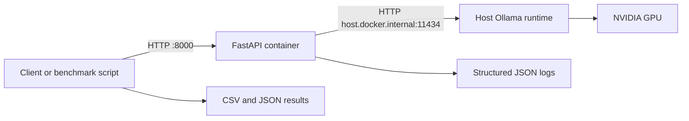

# Local GPU LLM Inference PoC

Containerized FastAPI gateway for local Ollama inference, with Docker GPU validation, health checks, structured logs, and repeatable benchmark tooling.

This repository is a local engineering proof of concept built to practice the deployment, monitoring, and benchmarking workflow used in AI infrastructure projects. It is designed around an NVIDIA RTX 4060 8 GB and prepares the same core skills used in a small GPU-cluster environment.

## Highlights

- **Containerized API gateway** with FastAPI and Docker Compose
- **Ollama-backed inference** through a configurable upstream endpoint
- **Operational checks** with liveness (`/health`) and readiness (`/ready`) endpoints
- **Structured JSON logs** with request IDs, latency, generated tokens, and generation rate
- **Benchmark automation** with concurrent requests, CSV/JSON artifacts, and worker sweeps
- **GPU verification** with a standalone CUDA container before debugging application behavior

## Architecture



By default, Ollama runs on the host and the FastAPI container forwards requests through `host.docker.internal`. In this mode, GPU execution happens in the host Ollama process. The API container includes an NVIDIA GPU device request for Docker-based model-runtime experiments, but it is not required when the container only proxies requests to host Ollama.

## Requirements

- Windows 11 with WSL2 Ubuntu and Docker Desktop WSL integration
- NVIDIA driver with `nvidia-smi` working
- Docker Engine with GPU support
- Ollama installed and running locally
- A pulled Ollama model, such as the default `qwen3.5:9b`

## Verify Docker GPU Access

First confirm that Docker can see the NVIDIA GPU independently from this application:

```bash
docker run --rm --gpus all nvidia/cuda:12.2.0-base-ubuntu22.04 \
  nvidia-smi --query-gpu=name,driver_version,memory.total --format=csv,noheader
```

Expected output includes the GPU name, NVIDIA driver version, and available VRAM. If this command fails, fix the NVIDIA driver, Docker Desktop GPU integration, or NVIDIA Container Toolkit configuration before troubleshooting Ollama or FastAPI.

## Quick Start

### 1. Start and verify Ollama

```bash
ollama list
ollama run qwen3.5:9b "Explain Docker in 2 sentences."
```

### 2. Build and start the API

```bash
docker compose up --build -d
```

The API is exposed at `http://localhost:8000`.

### 3. Validate the service

```bash
curl http://localhost:8000/health
curl http://localhost:8000/ready
```

Run a bounded generation request to keep response time predictable:

```bash
curl -X POST http://localhost:8000/generate \
  -H "Content-Type: application/json" \
  -d '{"prompt":"Explain Docker in 2 sentences.","model":"qwen3.5:9b","max_tokens":256}'
```

Or run the complete smoke test:

```bash
./scripts/smoke_test.sh
```

### 4. Monitor the GPU

Use a separate terminal while the model is serving requests:

```bash
nvidia-smi -l 1
```

Watch GPU memory, utilization, and temperature while the benchmark runs.

## Benchmarking

Run a bounded baseline before increasing concurrency:

```bash
MAX_WORKERS=1 MAX_TOKENS=256 python scripts/benchmark.py
```

Then compare a higher-concurrency run:

```bash
MAX_WORKERS=2 MAX_TOKENS=256 python scripts/benchmark.py
```

The benchmark writes:

- `results/benchmark_results.csv` - per-request latency, token count, and generation rate
- `results/benchmark_summary.json` - aggregated summary for the latest run
- `results/benchmark_summary_workers_<N>.json` - saved worker-specific summaries

Use `./scripts/bench_sweep.sh` to run the predefined worker sweep. Start with bounded output lengths; unconstrained generations can make short prompts produce thousands of tokens and distort latency comparisons.

### Current Local Results

The saved raw worker summaries for `qwen3.5:9b` on an RTX 4060 8 GB show the following behavior with an unconstrained output workload of 20 requests:

| Workers | Success | Mean latency | P50 | P90 | Mean generated tokens/s | Result |
| ---: | ---: | ---: | ---: | ---: | ---: | --- |
| 1 | 19/20 | 45.9 s | 41.0 s | 84.3 s | 24.7 | Completed with one failure |
| 2 | 19/20 | 95.5 s | 80.2 s | 158.1 s | 13.3 | Completed with one failure |
| 4 | Not recorded | - | - | - | - | Run saturated and was interrupted |

These results are a stress observation, not an interactive-latency target. The prompt requested two sentences, but successful responses ranged from approximately 598 to 3,216 generated tokens. The next controlled comparison should use `MAX_TOKENS=128` or `256` and capture GPU telemetry alongside the benchmark output.

For the full methodology, Docker GPU validation, documented limitations, and internship relevance, see [the project report](docs/AI_Infrastructure_Internship_Project_Report.md).

## Configuration

### API service

| Variable | Default | Purpose |
| --- | --- | --- |
| `OLLAMA_URL` | `http://host.docker.internal:11434/api/generate` | Upstream Ollama generation endpoint |
| `DEFAULT_MODEL` | `qwen3.5:9b` | Default model used by `/generate` |
| `REQUEST_TIMEOUT` | `180` | Upstream Ollama HTTP timeout in seconds |
| `LOG_LEVEL` | `INFO` | Application log verbosity |

### Benchmark script

| Variable | Default | Purpose |
| --- | --- | --- |
| `BASE_URL` | `http://localhost:8000` | FastAPI service base URL |
| `PROMPT` | `Explain Docker in 2 sentences.` | Prompt submitted to each request |
| `MODEL` | `qwen3.5:9b` | Model name passed to the API |
| `N_REQUESTS` | `20` | Total requests per run |
| `MAX_WORKERS` | `2` | Concurrent benchmark workers |
| `MAX_TOKENS` | unset | Optional generated-token limit |
| `OUTPUT_DIR` | `results` | Benchmark artifact directory |

## API Contract

| Endpoint | Purpose |
| --- | --- |
| `GET /health` | Confirms the FastAPI process is running |
| `GET /ready` | Confirms the configured Ollama service is reachable |
| `POST /generate` | Sends a prompt to Ollama and returns text plus timing/token metrics |

Example request body:

```json
{
  "prompt": "Explain Docker in 2 sentences.",
  "model": "qwen3.5:9b",
  "max_tokens": 256
}
```

## Repository Layout

```text
app/                 FastAPI application and JSON logging
scripts/             Smoke test, benchmark, and worker-sweep automation
docs/                Experiment records and mentor-facing project report
results/             Generated benchmark CSV and JSON artifacts
Dockerfile           FastAPI container image definition
docker-compose.yml   Local service configuration
```

## Operational Notes

- The current design has no request queue or concurrency limiter. Under heavy load, queued Ollama work can become upstream timeouts.
- `tokens_per_sec` is a per-request generation-rate observation, not total system throughput. Add requests/s and test wall time for broader capacity analysis.
- P95 is more informative than P99 when there are only about 20 successful samples. Use a nearest-rank percentile method before formal comparisons.
- Capture `ollama show <model>` output, GPU memory, utilization, temperature, CPU, and RAM with each future experiment.

## Documentation

- [Mentor-facing project report](docs/AI_Infrastructure_Internship_Project_Report.md)
- [Experiment template](docs/experiment_template.md)
- [Initial experiment note](docs/experiment_01_qwen3_5_9b_gpu.md)

## License

Released under the [MIT License](LICENSE).
