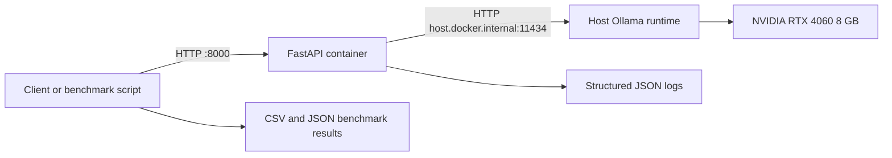

# Local GPU-Accelerated LLM Inference PoC

**Containerized serving, GPU validation, and load benchmarking on an NVIDIA RTX 4060 8 GB**

**Prepared by:** Kazi Md Samir  
**Email:** kzsamir849@gmail.com  
**Phone:** 01884382430  
**Repository:** https://github.com/kzmdsamir/llm-gpu-docker-mini  
**Project date:** 2026-08-04  
**Context:** Preparation for the Solar GPU PoC AI Infrastructure Internship

---

## Executive Summary

I built a local, GPU-backed LLM inference proof of concept to practice the deployment and operations work expected in an AI infrastructure internship. The project packages a FastAPI inference gateway in Docker, uses Ollama as the local model-serving runtime, validates NVIDIA GPU access from Docker, and includes automated smoke tests, structured JSON logs, concurrent load testing, and experiment documentation.

The implementation demonstrates an end-to-end engineering workflow: deploy a service, verify liveness and upstream readiness, observe GPU availability, run controlled load, preserve raw results, and turn the observations into concrete improvement actions. The work is a **local preparation PoC**, not a claim of production deployment or a solar-powered cluster.

## Project Goal

The goal was to create a reproducible local environment for lightweight GPU inference and to measure how an RTX 4060 8 GB behaves when serving a 9B Ollama model under increasing request concurrency. The project directly exercises the internship themes of containerized AI deployment, inference serving, GPU monitoring, benchmarking, troubleshooting, automation, and engineering documentation.

## System Architecture



The FastAPI service exposes a small API surface:

- `GET /health` is the liveness probe for the API process.
- `GET /ready` checks whether the upstream Ollama service can be reached.
- `POST /generate` forwards a prompt to Ollama, optionally accepts `max_tokens`, and returns latency, generated-token count, tokens per second, and a request ID.

The default deployment path runs Ollama on the host and connects to it from the container through `host.docker.internal`. Therefore, GPU computation happens in the host Ollama runtime. The FastAPI container is also configured with an NVIDIA GPU device request, but that GPU assignment is not required while the API only forwards requests to host Ollama. It becomes relevant if the model runtime is moved into Docker.

## Implementation Delivered

| Area | Delivered capability |
| --- | --- |
| API service | FastAPI gateway with `/health`, `/ready`, and `/generate` endpoints |
| Runtime configuration | Environment-driven model, Ollama URL, request timeout, and log level |
| Observability | Structured JSON logs with request IDs, latency, token count, and tokens per second |
| Containerization | Dockerfile and Docker Compose deployment, port `8000`, host Ollama connectivity |
| Validation | Automated smoke test for liveness, readiness, and a generation request |
| Benchmarking | Concurrent Python load test with CSV and JSON output plus worker sweep automation |
| Documentation | Reusable experiment template and recorded experiment notes |

## Environment and GPU Validation

| Component | Observed configuration |
| --- | --- |
| Host OS | Windows 11 with WSL2 Ubuntu and Docker Desktop |
| CPU | AMD Ryzen 7 7700, 8 cores |
| System memory | 32 GB RAM |
| GPU | NVIDIA GeForce RTX 4060, 8,188 MiB VRAM |
| NVIDIA driver | 596.49 |
| Docker Engine | 28.5.1 |
| Inference runtime | Host Ollama via `host.docker.internal:11434` |
| Model tag | `qwen3.5:9b` |

Docker-to-GPU access was independently verified with the cached CUDA image:

```bash
docker run --rm --gpus all nvidia/cuda:12.2.0-base-ubuntu22.04 \
  nvidia-smi --query-gpu=name,driver_version,memory.total --format=csv,noheader
```

The container reported `NVIDIA GeForce RTX 4060, 596.49, 8188 MiB`. This validates the NVIDIA driver, Docker Desktop GPU integration, and container device request path independently from the application.

## Benchmark Methodology

The benchmark issued 20 HTTP requests to the FastAPI `/generate` endpoint using a Python thread pool. The prompt was `Explain Docker in 2 sentences.` and the model was `qwen3.5:9b`. The script records per-request latency, generated token count, and reported generation rate, then writes an aggregate JSON summary.

Metrics reported:

- Success and failure count
- Mean request latency
- P50, P90, and P99 latency estimates
- Mean reported generated tokens per second

The test intentionally began without a `MAX_TOKENS` limit. This revealed a real operational issue: the model often generated far more than the requested two sentences, making response length a major source of latency variation. Successful requests in the saved worker-2 CSV range from 598 to 3,216 generated tokens.

## Results

The raw worker-specific JSON summaries are used as the source of truth. An earlier experiment note reports 20/20 success at two workers, but the saved sweep summaries record 19/20 success at both one and two workers. This discrepancy is retained as an engineering documentation item to correct, not hidden.

| Workers | Success | Mean latency | P50 | P90 | P99 | Mean generated tokens/s | Outcome |
| ---: | ---: | ---: | ---: | ---: | ---: | ---: | --- |
| 1 | 19/20 | 45.9 s | 41.0 s | 84.3 s | 93.2 s | 24.7 | Completed with one failure |
| 2 | 19/20 | 95.5 s | 80.2 s | 158.1 s | 175.0 s | 13.3 | Completed with one failure |
| 4 | Incomplete | - | - | - | - | - | Saturated; run interrupted |

## Analysis and Engineering Findings

1. **The GPU path works.** The host and a standalone CUDA container both detected the RTX 4060 and its 8 GB VRAM. This isolates GPU-container support from application-level behavior.
2. **The 9B model is usable only at limited concurrency on this hardware.** Mean latency more than doubled from 45.9 s at one worker to 95.5 s at two workers. Tail latency became substantially worse.
3. **Output length dominated the benchmark.** The unconstrained completion length did not match the two-sentence intent of the prompt. This makes the current results valuable as a stress observation, but not a controlled interactive-latency baseline.
4. **Overload produces a reliability problem, not only slower responses.** The four-worker run was incomplete, and application logs recorded upstream Ollama read timeouts under heavier load. The current 180-second request timeout is a safety bound, not a capacity guarantee.
5. **The current `tokens_per_sec` field is a per-request generation-rate observation.** It should not be presented as total system throughput. A future benchmark should additionally report requests per second and total generated tokens divided by wall-clock test duration.

The current P99 values are included for completeness, but P95 is more useful for a small sample of 19 successful requests. A nearest-rank percentile calculation should also replace the current extrapolating percentile method before using the metric for formal comparisons.

## Engineering Trade-offs and Limitations

- The workload used a single model and a short prompt but unconstrained generation length; it is not a broad model comparison.
- The saved benchmark CSV does not retain the exception text for failed requests, which limits post-run failure classification.
- GPU memory, utilization, temperature, CPU, and system RAM were monitored operationally with `nvidia-smi`, but time-series telemetry was not persisted alongside the benchmark result files.
- The project has health checks, logs, and reproducible scripts, but it does not claim production controls such as authentication, request queueing, autoscaling, persistent metrics, or alerting.
- Model quantization and model digest were not recorded. Future runs should capture `ollama show <model>` output with each experiment.

## Reproduction Workflow

```bash
# Confirm the model is available on the host
ollama list

# Start the API container
docker compose up --build -d

# Validate liveness, readiness, and a generation request
./scripts/smoke_test.sh

# Watch GPU memory and utilization in another terminal
nvidia-smi -l 1

# Run a bounded baseline experiment
MAX_WORKERS=1 MAX_TOKENS=256 python scripts/benchmark.py

# Compare bounded concurrency levels
MAX_WORKERS=2 MAX_TOKENS=256 python scripts/benchmark.py
```

The generated artifacts are written to `results/benchmark_results.csv` and `results/benchmark_summary.json`. Worker-specific summary files should be preserved for every completed sweep value.

## Recommended Next Experiments

1. Repeat the worker-1 and worker-2 tests with `MAX_TOKENS=128` and `256` to measure predictable interactive latency.
2. Capture model metadata, GPU memory, GPU utilization, temperature, CPU use, and host RAM in the experiment record.
3. Persist benchmark errors in the CSV and distinguish upstream timeout, connection failure, and HTTP error classes.
4. Add queue depth or an application concurrency limit so overload is explicit and measurable rather than only observed as timeouts.
5. Compare the 9B model with a smaller model suitable for 8 GB VRAM, using the same bounded workload and method.
6. Add Prometheus-compatible metrics and a small Grafana dashboard when moving from local experimentation to a shared cluster.

## Relevance to the AI Infrastructure Internship

| Internship focus | Evidence from this project |
| --- | --- |
| GPU cluster operations | NVIDIA driver and GPU visibility verified from host and CUDA container |
| Containerized AI deployments | Dockerfile, Compose deployment, GPU device request, host-runtime networking |
| Inference engines and serving | Ollama-backed FastAPI generation API with readiness checks |
| Monitoring and observability | Structured logs, request IDs, latency/token metrics, `nvidia-smi` workflow |
| Benchmarking and stress testing | Concurrent load test, saved CSV/JSON, worker sweep, overload observation |
| Troubleshooting | Distinguished Docker GPU access from Ollama latency and upstream timeout behavior |
| Automation and documentation | Smoke test, benchmark wrappers, sweep script, experiment template, report |

## Portfolio Statement

This project demonstrates that I can take a local AI inference service from deployment through verification and measurement: I containerized the API layer, validated GPU availability, automated health and benchmark checks, preserved performance evidence, identified the limits of a constrained GPU environment, and converted the findings into a concrete next-step plan for a larger infrastructure PoC.

## Evidence and Source Files

- Repository: https://github.com/kzmdsamir/llm-gpu-docker-mini
- Application: `app/main.py`
- Docker configuration: `Dockerfile`, `docker-compose.yml`
- Automation: `scripts/smoke_test.sh`, `scripts/benchmark.py`, `scripts/bench_sweep.sh`
- Raw results: `results/benchmark_results.csv`, `results/benchmark_summary_workers_1.json`, `results/benchmark_summary_workers_2.json`
- Experiment record: `docs/experiment_01_qwen3_5_9b_gpu.md`
